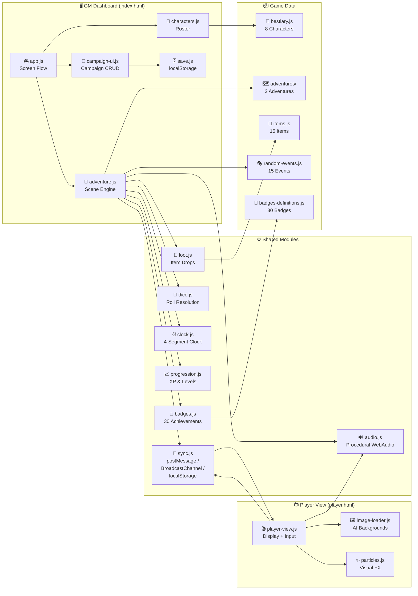

<div align="center">

# 🐆 ¡A la Carrera! — Interactive RPG Companion

**A web-based RPG companion app for kids, featuring dual-screen gameplay, procedural audio, and AI-generated art.**


**8 characters** · **2 adventures** · **30 badges** · **15 items** · **15 random events** · **30+ scenes**

</div>

---

## What This Does

This is a companion app for the tabletop RPG **"¡A la Carrera!"** (Scurry!) designed for parents playing with kids aged 4-8. The parent acts as Game Master on one screen while kids watch the story unfold on a second screen (TV/tablet). Kids pick options, roll physical dice, and the app handles narrative, sound effects, and visual feedback — turning a simple board game into a cinematic adventure.

## Architecture



## Status

| Component | Version | Status | Details |
|-----------|---------|--------|---------|
| GM Dashboard | 1.0 | ✅ Production | Full scene engine, campaign management |
| Player View | 1.1 | ✅ Production | Interactive choices, dice input, auto-continue |
| Sync System | 1.0 | ✅ Production | 3-layer fallback (postMessage → BroadcastChannel → localStorage) |
| Audio Engine | 1.0 | ✅ Production | 100% procedural, 6 ambient presets, 8 SFX |
| Adventure: Tesoro de los Titanes | 1.0 | ✅ Complete | 5 scenes + victory, difficulty 1 |
| Adventure: Bosque de las Sombras | 1.0 | ✅ Complete | 5 scenes + victory, difficulty 2 |
| Campaign System | 1.0 | ✅ Production | Save/load, XP, levels, badges, inventory |
| AI Scene Backgrounds | 1.0 | ✅ Optional | 6 scene images + 5 character portraits |

## Quick Start

### Prerequisites
- Any modern browser (Chrome, Safari, Firefox, Edge)
- No build tools, no npm, no server required

### Run

```bash
# Option 1: Open directly (works on file://)
open index.html        # macOS
start index.html       # Windows
xdg-open index.html    # Linux

# Option 2: Local server (enables BroadcastChannel sync)
python3 -m http.server 8000
# Then open http://localhost:8000
```

### Verify It Works
1. Open `index.html` → You see the title screen with character selection
2. Open `player.html` in a second tab/window → Shows "Esperando al Game Master..."
3. Select 2+ characters on GM screen → They appear on player screen
4. Click "¡A la aventura!" → Both screens sync to Scene 1

### Dual-Screen Setup
| Screen | Opens | Role |
|--------|-------|------|
| GM (laptop) | `index.html` | Controls story, sees notes, resolves dice |
| Player (TV/tablet) | `player.html` | Shows narrative, choices, animations |

Players can also drive the game from `player.html` — clicking choices and entering dice results directly.

## Documentation Map

| Document | Audience | Description |
|----------|----------|-------------|
| [README.md](README.md) | Everyone | Project overview, architecture, quick start |
| [css/README.md](css/README.md) | Developers | Stylesheet organization and theming |
| [js/README.md](js/README.md) | Developers | Module architecture and dependencies |
| [js/data/README.md](js/data/README.md) | Developers / Content | Game data: characters, scenes, items, badges |
| [js/data/adventures/README.md](js/data/adventures/README.md) | Content creators | How to create new adventures |
| [assets/README.md](assets/README.md) | Artists | AI image prompts and asset pipeline |
| [CLAUDE.md](CLAUDE.md) | AI assistants | Compact project context for AI coding tools |

## Project Structure

```
├── index.html                      # GM Dashboard (main SPA)
├── player.html                     # Player View (companion display + input)
├── CLAUDE.md                       # AI assistant context
│
├── css/                            # Stylesheets (7 files)
│   ├── styles.css                  # CSS variables, reset, global layout
│   ├── animations.css              # @keyframes for UI effects
│   ├── characters.css              # Character card components
│   ├── dice.css                    # Dice roll animations
│   ├── adventure.css               # Scene display, GM panels, choices
│   ├── gm.css                      # GM Dashboard-specific layout
│   └── projection.css              # Fullscreen projection mode
│
├── js/                             # Application logic (17 modules)
│   ├── app.js                      # Main controller, screen transitions
│   ├── adventure.js                # Scene engine, dice resolution, sync
│   ├── characters.js               # Character selection, tag checking
│   ├── player-view.js              # Player screen controller + interactivity
│   ├── sync.js                     # IPC: postMessage / BroadcastChannel / localStorage
│   ├── audio.js                    # Procedural Web Audio API (no files)
│   ├── dice.js                     # Roll resolution (d4-d20 → critico/exito/etc)
│   ├── clock.js                    # 4-segment tension clock
│   ├── progression.js              # XP table, 7 levels
│   ├── badges.js                   # Badge detection engine
│   ├── loot.js                     # Weighted item generation
│   ├── campaign-ui.js              # Campaign CRUD screens
│   ├── save.js                     # localStorage persistence
│   ├── image-loader.js             # AI background preloader
│   ├── particles.js                # Confetti and ambient particles
│   ├── resolution-generator.js     # Narrative variation generator
│   └── projection.js               # Fullscreen API wrapper
│
├── js/data/                        # Game content (static data)
│   ├── bestiary.js                 # 8 playable characters
│   ├── items.js                    # 15 loot items (consumable/permanent/cosmetic)
│   ├── badges-definitions.js       # 30 badges across 5 categories
│   ├── random-events.js            # 15 random encounter events
│   ├── scenes.js                   # Legacy scene file (not loaded)
│   └── adventures/                 # Multi-adventure system
│       ├── adventure-registry.js   # Registry pattern for adventure loading
│       ├── tesoro-titanes.js       # Adventure 1: treasure hunt (beginner)
│       └── bosque-sombras.js       # Adventure 2: shadow forest (intermediate)
│
└── assets/                         # AI-generated images
    ├── IMAGE_PROMPTS.md            # Prompts used for image generation
    ├── characters/                 # Character portraits (5 available)
    └── scenes/                     # Scene backgrounds (6 available)
```

## Game Mechanics

Based on **Scurry!** (3rd Edition) by Brian Tyrrell:

| Roll Result | Condition | Effect | Clock |
|-------------|-----------|--------|-------|
| ⭐ Crítico | Roll ≥ difficulty + 5 | Spectacular success | — |
| ✅ Éxito | Roll ≥ difficulty | Success | — |
| ⚠️ Complicación | Roll ≥ difficulty - 4 | Success with cost | +1 |
| 🎪 ¡Oh No! | Roll < difficulty - 4 | Chaotic fun outcome | +1 |

### Advantage System
Each character has 4 **tags** (ability, tool, talent, trait). If a tag matches the scene option's `tagsRelevantes`, roll **2 dice, keep best**. The **ability** grants auto-success on first use, then becomes advantage.

### Clock & Difficulty
The clock has 4 segments. Each complicación fills 1. When full: clock resets, difficulty +2. This creates natural tension escalation.

### Progression
7 levels from "Explorador Novato" (0 XP) to "Titán Honorario" (560 XP). XP earned from scene completion, critical rolls, adventure completion, and clean clock runs.

## Technology

| Tech | Purpose |
|------|---------|
| HTML5 / CSS3 / Vanilla JS | Zero dependencies, works on `file://` |
| Web Audio API | 100% procedural audio — no sound files |
| postMessage + BroadcastChannel | Real-time GM ↔ Player sync |
| localStorage | Campaign persistence (max 5 saves) |
| CSS gradients + animations | Scene backgrounds (fallback when no AI images) |
| AI-generated PNGs | Optional cinematic backgrounds and portraits |

## Credits

- Original game: **Scurry!** by [Brian Tyrrell / Stout Stoat Press](https://www.stoutstoat.co.uk/)
- Spanish edition: **¡A la Carrera!** by [Devir](https://devir.es/a-la-carrera)
- This app is a fan-made companion and is not officially affiliated with Devir or Stout Stoat Press
