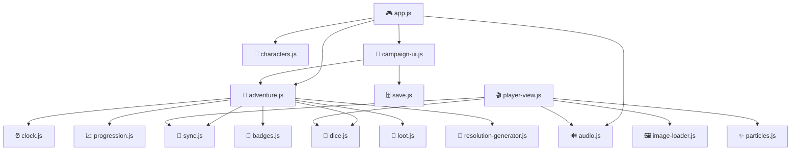

# js/ — Application Modules

17 vanilla JS modules, no bundler, no framework. All modules attach to `window.Carrera` namespace.

## Module Dependency Graph

## Modules

### Core

| Module | Namespace | Description |
|--------|-----------|-------------|
| `app.js` | `Carrera.app` | Main controller — screen transitions, keyboard shortcuts, init |
| `adventure.js` | `Carrera.adventure` | Scene engine — loads scenes, resolves options, manages game state |
| `sync.js` | `Carrera.sync` | GM ↔ Player IPC with 3-layer fallback |
| `player-view.js` | `Carrera.playerView` | Player display + interactive input (choices, dice, continue) |

### Mechanics

| Module | Namespace | Description |
|--------|-----------|-------------|
| `dice.js` | `Carrera.dice` | Roll resolution: value vs difficulty → critico/exito/complicacion/juerga |
| `clock.js` | `Carrera.clock` | 4-segment tension clock, difficulty escalation |
| `progression.js` | `Carrera.progression` | XP awards, 7-level system |
| `badges.js` | `Carrera.badges` | Achievement detection engine (30 badges) |
| `loot.js` | `Carrera.loot` | Weighted random item generation, inventory management |

### UI & Effects

| Module | Namespace | Description |
|--------|-----------|-------------|
| `characters.js` | `Carrera.characters` | Character selection, tag checking, advantage detection |
| `campaign-ui.js` | `Carrera.campaignUI` | Campaign list, adventure select, save/load screens |
| `audio.js` | `Carrera.audio` | Procedural Web Audio — 6 ambient presets, 8+ SFX |
| `image-loader.js` | `Carrera.images` | AI image preloader with availability checking |
| `particles.js` | `Carrera.particles` | Ambient particles (leaves, fireflies, sparkles) |
| `resolution-generator.js` | `Carrera.resolutions` | Narrative variation for GM proposal selection |
| `projection.js` | `Carrera.projection` | Fullscreen API wrapper |

### Persistence

| Module | Namespace | Description |
|--------|-----------|-------------|
| `save.js` | `Carrera.save` | localStorage CRUD for campaigns (max 5) |

## Player-Driven Mode

When actions originate from `player.html`, the engine tracks `state.playerDriven = true` and:
- Skips GM resolution proposal selection
- Auto-sends original result text to player
- Player sees "Continuar" button to advance scenes

Messages from player → GM:
| Message | Trigger | GM Action |
|---------|---------|-----------|
| `player_choice_select` | Player clicks choice | `gmResolveOption(opciones[index])` |
| `player_dice_roll` | Player enters dice result | `inlineResolveRoll(opcion)` |
| `player_continue` | Player clicks continue | `loadScene(pendingNextScene)` |
