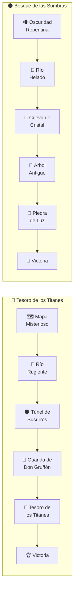

# adventures/ — Multi-Adventure System

Self-registering adventure files. Each adventure is a standalone JS file that registers itself with the adventure registry on load.

## Available Adventures

| ID | Title | Difficulty | Scenes | Duration |
|----|-------|------------|--------|----------|
| `tesoro-titanes` | La Búsqueda del Tesoro de los Titanes | 1 (Beginner) | 5 + victory | 30-45 min |
| `bosque-sombras` | El Bosque de las Sombras | 2 (Intermediate) | 5 + victory | 30-45 min |

## Scene Flow



## Adventure Structure

Each adventure file exports an object with this shape:

```javascript
{
    id: 'adventure-id',
    titulo: 'Adventure Title',
    emoji: '💎',
    descripcion: 'One-line description',
    dificultad: 1,              // 1-3
    nivelRecomendado: 1,         // Suggested player level
    duracion: '30-45 min',
    totalEscenas: 5,
    scenes: {
        scene1: { /* Scene object */ },
        scene2: { /* ... */ },
        // ...
        victoria: { esFinal: true, opciones: [] }
    },
    juergasGenericas: [ /* Fallback juerga texts */ ]
}
```

## Scene Object

```javascript
{
    id: 'scene1',
    titulo: 'Scene Title',
    emoji: '🗺️',
    ambientPreset: 'forest',           // Audio preset
    backgroundClass: 'bg-forest-clearing', // CSS class
    narrativa: 'Story text shown to players...',
    notasGM: 'GM-only hints and stage directions...',
    esFinal: false,                     // true for scene5 and victoria
    opciones: [
        {
            id: '1a',
            texto: 'Choice text',
            emoji: '🏃',
            requiereTirada: true,        // false = direct progression
            dificultad: 8,
            tagsRelevantes: ['Tag1', 'Tag2'],  // Must match bestiary tags
            siguienteEscena: 'scene2',

            // Optional modifiers:
            autoExitoTags: ['Gema Brillante'],    // Auto-success if team has this tag
            autoExitoFlags: ['bellotaRegalo'],     // Auto-success if flag was set
            ventajaConFlags: ['ayudaTejon'],       // Advantage if flag was set
            usaPistaExtra: true,                   // Advantage if pistaExtra flag set

            resultados: {
                critico:      { texto: '...', reloj: 0, flag: null },
                exito:        { texto: '...', reloj: 0, flag: 'flagName' },
                complicacion: { texto: '...', reloj: 1, flag: null },
                juerga:       { texto: '...', reloj: 1, flag: 'otherFlag' }
            }
        }
    ]
}
```

## Flag System

Flags are set by scene results and consumed by later scenes:

| Flag | Set In | Used In | Effect |
|------|--------|---------|--------|
| `pistaExtra` | Scene 1 (critico) | Scene 3 (advantage), Scene 5 (advantage) | Extra clue |
| `bellotaRegalo` | Scene 1 (juerga) | Scene 4 (auto-success) | Gift for Don Gruñón |
| `amigaRana` | Scene 3 (juerga) | Badge unlock | Secret friend |
| `mapasTunel` | Scene 3 (critico) | Scene 5 (advantage) | Ancient maps |
| `ayudaTejon` | Scene 4 (success+) | Scene 5 (advantage) | Badger's help |

## Creating a New Adventure

1. Create `js/data/adventures/your-adventure.js`
2. Follow the adventure structure above
3. Self-register at the end:
   ```javascript
   if (window.Carrera.adventureRegistry) {
       window.Carrera.adventureRegistry.register(adventure);
   }
   ```
4. Add `<script src="js/data/adventures/your-adventure.js"></script>` to both HTML files
5. Valid `backgroundClass` values: `bg-forest-clearing`, `bg-river`, `bg-tunnel`, `bg-den`, `bg-treasure`, `bg-victory`

## Validation

All adventure paths can be validated with a Node.js simulation script. Last run: **373,248 paths tested, 0 errors** (2026-03-26).
